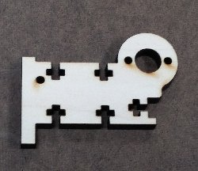
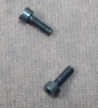
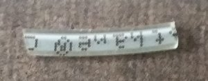
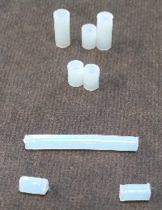

**Conveyor Bill of Materials**

|Image | Name | Description | Source |
| --- | --- | --- | --- |
||Top Plate|Laser Cut 2mm clear acrylic sanded with 220 grit| Common |
||Side Rails, Qty of 2|Laser Cut 6mm Baltic Birch Plywood| Most woodworker supply / hardwood stores have this|
||Motor Rail|Laser Cut 6mm Baltic Birch Plywood| " |
||End Plate|Laser Cut 3mm Baltic Birch Plywood|"|
||Motor End Plate|Laser Cut 3mm Baltic Birch Plywood| "|
||Belt|0.15mm Thick 30mm wide 442mm long polyurethane | Search "TPU Tape" on AliExpress.com |
||Motor|24 volt DC motor (385) 3500RPM, 0.1 Amp | 2120461 at Jameco.com |
||Nuts| Standard 4-40 Nut, Qty of 15 | Common |
||Screws| 4-40 pan head screws 1/2"Qty 7 -- 3/8"qty 7 | Common |
||Motor Screws| M2.6(.45mm) - 8 mm qty 2 | Hard to find!, Mcmaster-Carr, Aliexpress |
||Shafts|42 and 60mm 2mm steel shafts | Common, Mcmaster-Carr, Aliexpress, Etc |
||Shaft to motor Coupling|17mm long 1/16" ID 1/8" OD polyurethane tubing  | Mcmaster-Carr 	5549K43 |
||Bushings|Two types right now. #2 nylon spacers, one 1/4" and two 1/2"  or 3/32" ID, Teflon  tubing 5/32" OD cut 29.5mm long | Mcmaster-Carr |
||Bearings|Two 692zz 2x6x3mm bearings for the motor side shaft. You only need bushings or bearings. The nylon bushings are squeaky and only last like 200 hours. | AliExpress.com |
||Pulley|Two types right now. #2 nylon spacer two 1/2" or Teflon tubing 3/32" ID, 5/32" OD, two cut 6mm long. These might have to on bearings as well...| Mcmaster-Carr |

