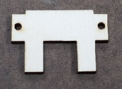

**Conveyor Bill of Materials**

|Part| Name | Description | Source |
| --- | --- | --- | --- |
||Top Plate|Laser Cut 2mm clear acrylic sanded with 22o grit| | |
||Side Rails|Laser Cut 6mm Baltic Birch Plywood| |
||Motor Rail|Laser Cut 3mm Baltic Birch Plywood| |
||End Plate|Laser Cut 3mm Baltic Birch Plywood| |
||Motor End Plate|Laser Cut 3mm Baltic Birch Plywood| |
||Belt|0.15mm Thick 30mm wide polyurethane | Search "TPU Tape" on AliExpress.com |

